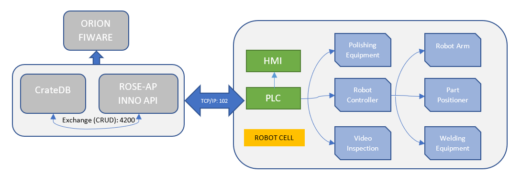

# Inno-West
 ROSE-AP automated planning

The main service contributed by the ROSE-AP is automated planning, to minimize the up-front automated robotic cell productivity 

## Contents

-   [Background](#background)
-   [Architecture](#architecture)
-   [Requirements](#requirements)
-   [Install](#install)
-   [Usage](#usage)
-   [API](#api)
-   [License](#license)

## Background

## Architecture

## Requirements

Broker requires Crate database, thus install the following [docker](/docker/) image and also [.net5](https://dotnet.microsoft.com/en-us/download/dotnet/5.0) framework or newer.

## Installation

### API

## License
The INNO WEST ROSE-AP components are licensed under [Apache 2.0](/LICENSE) © 2022 INNO ROBOTICS S.R.L.
