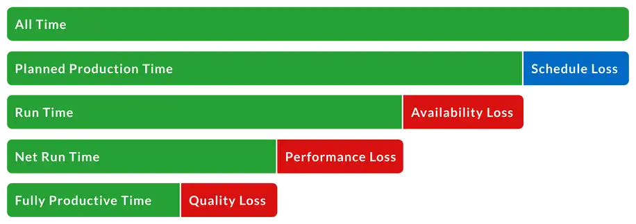
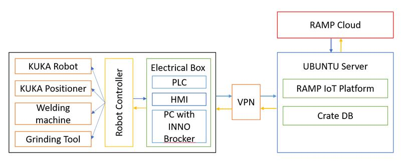

# Inno-West
 ROSE-AP automated planning

The main service contributed by the ROSE-AP is automated planning, to minimize the up-front automated robotic cell productivity 

## Contents

-   [Background](#background)
-   [Architecture](#architecture)
-   [Requirements](#requirements)
-   [Install](#instalation)
-   [License](#license)

## Background

This TTE addresses the manufacturing process of metal structures and parts manufacture and assembly of products made of metal components. The problem that will solved by completing this TTE is the robotization of the process of polishing and welding parts used in various products such as those intended for the food industry, the automotive industry, construction or furniture, etc.

The main service contributed by the ROSE-AP is automated planning, to minimize the up-front automated robotic cell productivity by utilizing:
-	Data Collection – Automatic data collection which will be used for a concise evaluation of the entire process
-	Product Tracking - manage the production process in real time
-	Performance Analysis – using collected data a real time performance analysis helps improving the OEE KPIs

## Architecture

## Requirements

The following are required in order to utilize the product:
- Docker installed with [RAMP IoT](https://github.com/karikolehmainen/RAMP-IoT/tree/c05fac70e8478554a93a9bbe4470516106c92166) Plarform is FIWARE-based package
- Running instance of the API Inno Broker
- Welding and Polish Robot cell

## Instalation

Details on the installation procedure are to be found under [Docker](/docker/) and [API](/api/)

## License
The Inno West Rose-AP components are licensed under [Apache 2.0](/LICENSE) © 2022 Inno Robotics S.R.L.
