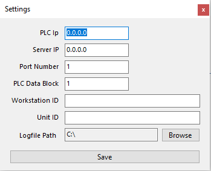
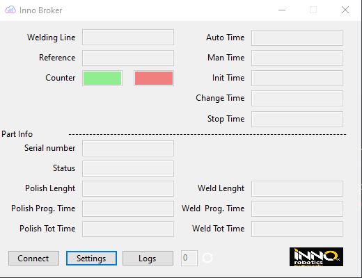
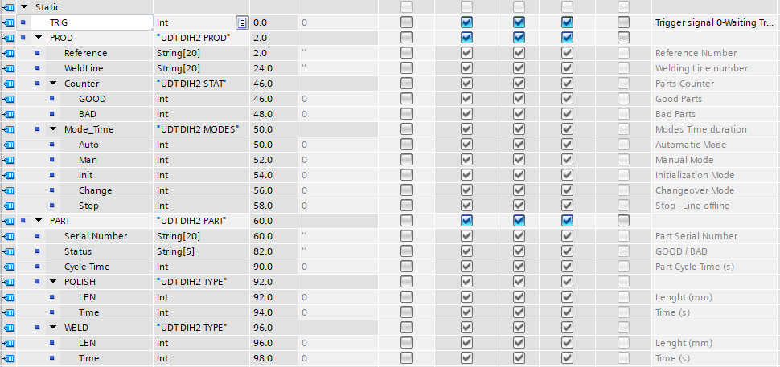

# Inno Broker API Manual

The main service contributed by the ROSE-AP is automated planning, to minimize the up-front automated robotic cell productivity 

## Contents

-   [Requirements](#requirements)
-   [Configuration](#configuration)
-   [Usage](#usage)
-   [Testing](#testing)
-   [License](#license)

## Requirements

In order to utilize the product [.net5](https://dotnet.microsoft.com/en-us/download/dotnet/5.0) framework or higher needs to be installed on the same machine with the docker.

## Configuration

All configrations are done in the settings page of the broker.

1. PLC Ip: is the IP of the programable controller which drives the robot cell and gathers the data.
2. Server Ip: is the IP of the docker image with the Crate data base.
3. User: Username to access the db.
4. Pw: Password to access the db.
5. Production Table: Is the table from the CrateDB where the production data will be stored.
6. Part Table: Is the table from the CrateDB where the parts data will be stored.

> Optional it can be added to run automaticaly at startup. 

## Usage

First step is to have the docker database configured as descried [here](/docker/README.md)
Second of all is to program the PLC (programable logic controller) to exchange data with the broker. 
To achive this some steps need to be reached:

1. First and formemost the broker is built in mind with only the siemens PLCs and there needs to be a DB (datablock) number 26. 

> The code for it be found here as ['DB_DIH2_EX.db'](/api/DB_DIH2_EX.db). 

2. The following structure needs to be built in.

> The code for it be found here as ['UDT_DB_DIH2_EX.db'](/api/UDT_DB_DIH2_EX.udt).

3. To able to communicate with the PLC a protocol was put in place. The TRIG signal that is of type INT will be our exchange interface with predefined commands as follow:  
* 0   - Waiting Trigger;  
* 1   - Trigger to Write Production data;  
* 2   - Trigger to Write Part data;  
* 100 - Write Production Error;  
* 101 - Write Part Error; 
* 255 - Bussy; 

4. After creating the logic and the DB in the PLC we can start our api. If the connection is not succesfull an error will be thrown in the logfile.

## Testing

Testing the data exchange between PLC-API-FIWARE can be done in the created interface of the apic or via the logfile if there are errors or something doens't seem to be working.  
This data exchange is done in realtime (~500ms) and the data is refreshed at every cycle.

## License
The Inno West Rose-AP components are licensed under [Apache 2.0](/LICENSE) © 2022 Inno Robotics S.R.L.
