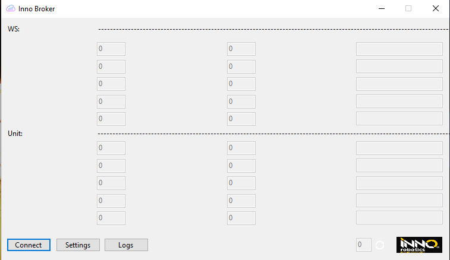
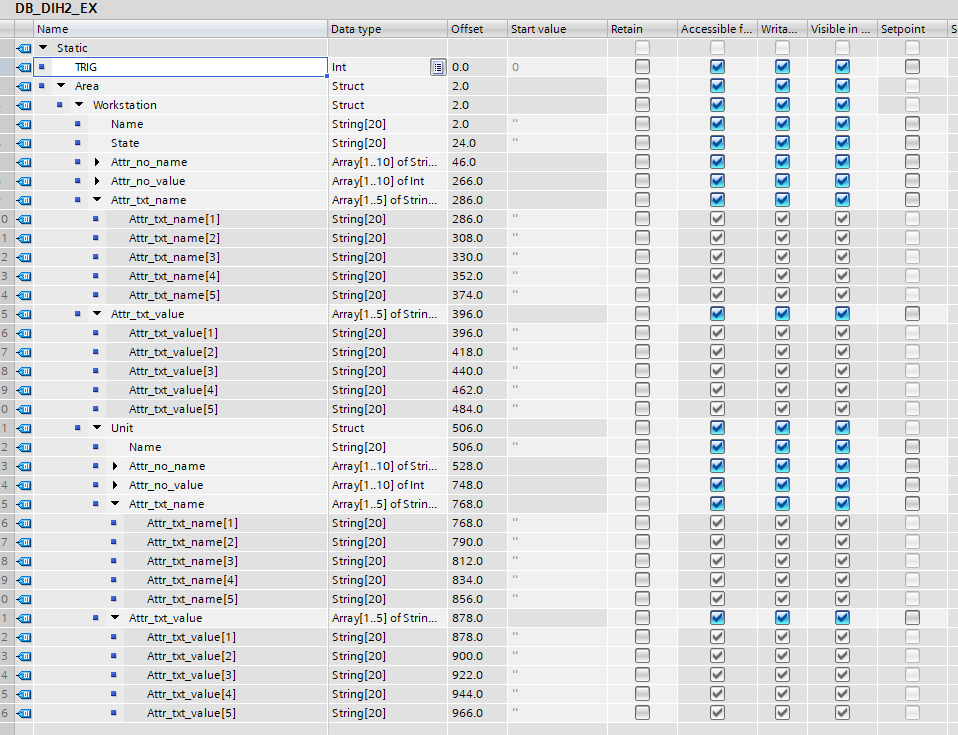

# Inno Broker API Manual

The main service contributed by the ROSE-AP is automated planning, to minimize the up-front automated robotic cell productivity 

## Contents

-   [Requirements](#requirements)
-   [Configuration](#configuration)
-   [Usage](#usage)
-   [Testing](#testing)
-   [License](#license)

## Requirements

In order to utilize the product [.net5](https://dotnet.microsoft.com/en-us/download/dotnet/5.0) framework or higher needs to be installed on the same machine with the docker.
Also it requires a preinstalled functional welding robot cell with a Siemens PLC.

## Configuration

All api configrations are done in the settings page of the broker.

1. PLC Ip: is the IP of the programable controller which drives the robot cell and gathers the data.
2. Server Ip: is the IP of the docker image with the Crate data base.
3. Port number used to connect with the server.
4. PLC Datablock: Datablock number from the logic controller.
5. Workstation ID: Workstation identification for the workstation going to be used .
6. Unit ID: Unit identification for the unit going to be used.

> Optional it can be added to run automaticaly at startup via the startup windows tool or the task scheduler by creating a new task with the api.
> 1. Startup folder can be accessed via Run and type in *shell:startup*.
> 2. Add the shortcut of the api here.

## Usage

First step is to have the docker database configured as descried [here](/docker/README.md)
Second of all is to program the PLC (programable logic controller) to exchange data with the broker. 
To achive this some steps need to be reached:

1. First and formemost the broker is built in mind with only the siemens PLCs and there needs to be a DB (datablock) imported from our template. 

> The code for it be found here as ['DB_DIH2_EX.db'](/api/DB_DIH2_EX.db). 

2. The following structure will be generated in.

3. To able to communicate with the PLC a protocol was put in place. The TRIG signal that is of type INT will be our exchange interface with predefined commands as follow:  
* 0   - Waiting Trigger;  
* 1   - Trigger to Write Workstation data;  
* 2   - Trigger to Write Unit data;  
* 3   - Trigger to Write Workstation status;  
* 100 - Write Production Error;  
* 101 - Write Part Error; 
* 255 - Bussy; 

4. After creating the logic and the DB in the PLC we can start our api. If the connection is not succesfull an error will be thrown in the logfile.

## Testing

For a connection test with the PLC we can check the lower right status life beat indicator. 
Debug and testing of the data exchange between PLC-API-FIWARE can be done in the created interface of the api or via the logfile if there are errors or something doens't seem to be working.  
This data exchange is done in realtime (~500ms) and the data is refreshed at every cycle.   
For data test a PLC logic needs to be configured in order to be able to use the trigger and generate data to be sent.

## License
The Inno West Rose-AP components are licensed under [Apache 2.0](/LICENSE) © 2022 Inno Robotics S.R.L.
